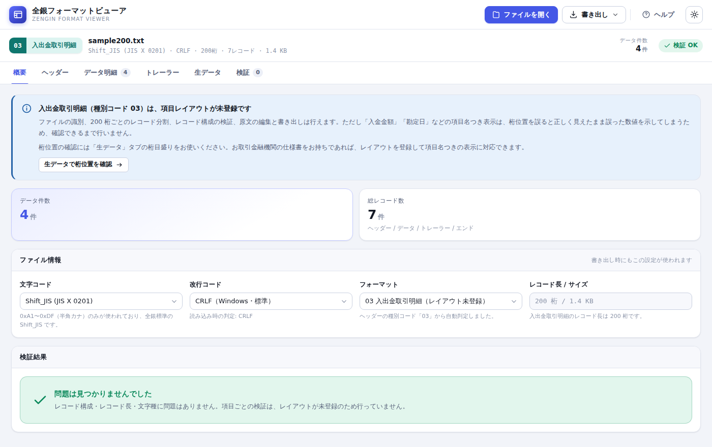
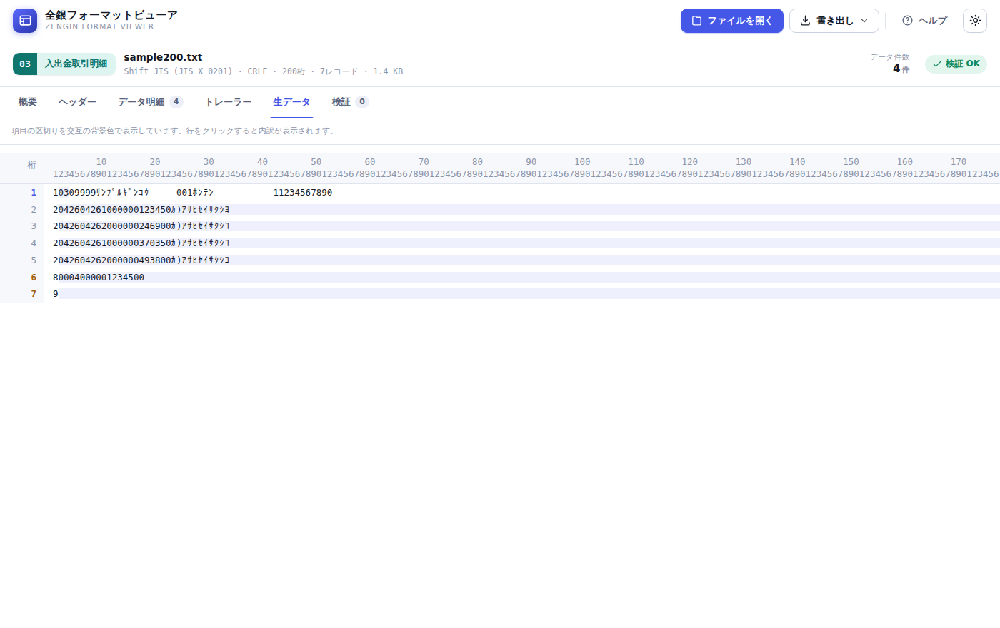

# 全銀フォーマットビューア

**全銀固定長データを、ブラウザ上で表として確認・編集できるツールです。**

日本の企業で使われる全銀協制定フォーマット（総合振込・給与振込・賞与振込・預金口座振替）の
固定長テキストファイルを読み込むと、ヘッダーレコードの種別コードから**フォーマットを自動判定**し、
項目名つきの表で表示します。内容を編集して、**元どおりの固定長形式で書き出す**こともできます。

### 🔗 [ブラウザで開く（GitHub Pages）](https://masakiniwa.github.io/Zengin-Format-Viewer/)

> **データは端末の外に出ません。**
> 読み込み・編集・書き出しのすべてがブラウザ内で完結します。
> サーバーへの送信、外部サービスとの通信、ブラウザへの保存は一切行いません。


---

## 目次

- [特長](#特長)
- [対応フォーマット](#対応フォーマット)
- [使い方](#使い方)
- [画面の紹介](#画面の紹介)
- [安全性について](#安全性について)
- [動作環境](#動作環境)
- [オフライン（社内ネットワーク）で使う](#オフライン社内ネットワークで使う)
- [開発者向け](#開発者向け)
- [ライセンス](#ライセンス)
- [免責事項](#免責事項)

---

## 特長

| | |
| --- | --- |
| **種別コードを自動判定** | ヘッダーレコードの 2〜3 桁目を読み取り、フォーマットを自動で切り替えます。文字コード（Shift_JIS / UTF-8）、改行コード（CRLF / LF / 改行なし）、レコード長（120 桁 / 200 桁）も自動判定します。 |
| **項目名つきの表で確認** | 「81〜90 桁目」ではなく「振込金額」として読めます。金額はカンマ区切り、預金種目などのコードは意味を併記します。 |
| **その場で編集** | 表計算ソフトのようにセルを編集できます。桁揃え（数字は右詰め 0 埋め、文字は左詰め空白埋め）は自動です。 |
| **全角を自動で半角へ** | `カブシキガイシャ` → `ｶﾌﾞｼｷｶﾞｲｼｬ`、`１２３ＡＢＣ` → `123ABC` のように、全銀で使える文字へ自動変換します。 |
| **提出前の自動チェック** | 桁数・文字種・必須項目・データ区分の並び順・**トレーラーの合計件数／合計金額の整合**などを検証し、該当行へジャンプできます。 |
| **バイト単位で正確に書き出し** | 未編集なら、読み込んだファイルと 1 バイトも違わないデータを出力します。ダミー領域や未定義バイトもそのまま保持されます。 |
| **CSV 書き出し** | 明細一覧を Excel で開ける CSV として保存できます。 |
| **見やすい画面** | ライト／ダークの両テーマに対応。印刷にも配慮しています。 |

---

## 対応フォーマット

### 銀行へ提出するデータ（120 桁・項目名つきで表示／編集）

| 種別コード | 名称 | 用途 |
| --- | --- | --- |
| `21` | 総合振込 | 取引先への支払を一括で依頼する |
| `11` | 給与振込 | 従業員の給与を一括で振り込む |
| `12` | 賞与振込 | 賞与（ボーナス）を一括で振り込む |
| `91` | 預金口座振替 | 売掛金などを取引先口座から引き落とす（結果ファイルの読み込みにも対応） |

### 銀行から受け取るデータ（200 桁・項目レイアウトは未登録）

| 種別コード | 名称 | 用途 |
| --- | --- | --- |
| `01` | 振込入金通知 | 自社口座への振込入金の明細を受け取る |
| `02` | 残高通知 | 口座残高を受け取る |
| `03` | 入出金取引明細 | 口座の入出金取引明細を受け取る |

これらは種別コードとレコード長を判定できるため、**ファイルの識別・レコード分割・
レコード構成の検証・原文の編集と書き出し**は行えます。「生データ」タブの桁目盛りで
桁位置を確認する用途にはそのままお使いいただけます。

いっぽう「入金金額」「勘定日」といった**項目名つきの表示は行っていません**。
これらのフォーマットは金融機関ごとに桁位置の運用が異なることがあり、誤った桁位置で
表示すると画面上は正しく見えたまま誤った金額を示してしまうためです。
お取引金融機関の仕様書に基づくレイアウトを `assets/js/formats.js` に登録すれば、
他のフォーマットと同じように項目名つきで表示できます（[追加方法](#フォーマットを追加する)）。
仕様書をお持ちの方は Issue でご提供いただけると助かります。



「生データ」タブでは 200 桁ぶんの桁目盛りが表示されるため、金融機関の仕様書と
突き合わせながら桁位置を確認できます。



いずれのフォーマットも **ヘッダー(1) → データ(2)×n → トレーラー(8) → エンド(9)** の構成です。

上記以外の種別コードのファイルも読み込めます。その場合は桁の意味を解釈せず、
レコード単位の原文表示になります（保存しても内容は壊れません）。

各フォーマットの詳細な桁位置は **[レコードレイアウト仕様](docs/format-spec.md)** をご覧ください。

---

## 使い方

### 1. ファイルを読み込む

[ツールを開き](https://masakiniwa.github.io/Zengin-Format-Viewer/)、全銀テキストファイルを
**ドラッグ＆ドロップ**するか、「ファイルを開く」から選択します。
手元にファイルが無いときは、初期画面の**サンプルデータ**でお試しいただけます。


### 2. 内容を確認する

読み込むと、種別・件数・合計金額・委託者情報などが「概要」タブに表示されます。
明細は「データ明細」タブで確認できます。


### 3. 編集する

セルをクリックして選択し、そのまま入力するか <kbd>Enter</kbd> で編集を開始します。

| キー | 動作 |
| --- | --- |
| <kbd>↑</kbd> <kbd>↓</kbd> <kbd>←</kbd> <kbd>→</kbd> | セルの移動 |
| <kbd>Enter</kbd> | 編集開始／確定して下のセルへ |
| <kbd>Tab</kbd> | 確定して右のセルへ |
| <kbd>Esc</kbd> | 編集を取り消す |
| <kbd>Delete</kbd> | 選択中のセルを空にする |
| <kbd>Ctrl</kbd> + <kbd>S</kbd> | 全銀固定長で書き出す |
| <kbd>F1</kbd> | ヘルプを開く |

> 💡 **行を追加・削除・金額変更したら「合計を再計算」を押してください。**
> トレーラーレコードの合計件数・合計金額がデータレコードから自動で計算し直されます。

### 4. 書き出す

画面上部の「書き出し」から、**全銀固定長**または **CSV** で保存します。
文字コードと改行コードは「概要」タブのファイル情報で指定できます。

### 使い方に迷ったら

画面右上の **「ヘルプ」ボタン**（または <kbd>F1</kbd>）から、ツール内で使い方ガイドを開けます。
レコードレイアウトの一覧もこの中で確認できます。


---

## 画面の紹介

### ヘッダー・トレーラー — 項目ごとのフォーム編集

桁位置・桁数・属性を表示しながら、委託者コードや取組日などを安全に編集できます。
固定値の項目（データ区分・種別コード）は誤操作を防ぐため編集できません。


### 生データ — 桁目盛りつきの原文表示

固定長の原文を、桁目盛りと項目ごとの色分けつきで表示します。
**半角カナを含む行でも桁位置がずれない**よう描画しているため、桁ズレの調査に使えます。
行をクリックすると、全項目の内訳が表示されます。


### 検証 — 提出前のチェック

見つかった問題を「エラー（修正が必要）」「警告（確認をおすすめします）」に分けて一覧表示し、
該当のレコードへジャンプできます。


### ダークテーマ

画面右上のボタンでライト／ダークを切り替えられます。設定はブラウザに記憶されます。


---

## 安全性について

全銀データには口座番号や氏名などの重要な情報が含まれます。本ツールは次の方針で作られています。

- **通信を一切行いません。** ファイルの読み込みから書き出しまで、すべてブラウザ内（JavaScript）で処理します。
- **外部ライブラリを使いません。** CDN からの読み込みもないため、依存先から情報が漏れる経路がありません。
- **保存しません。** 読み込んだ内容は画面を閉じるとメモリから消えます（記憶するのは画面テーマの設定のみです）。
- **改ざんしません。** 編集していない箇所は、ダミー領域や未定義バイトも含めて 1 バイトも変更せずに書き戻します。

ソースコードはすべてこのリポジトリで公開しています。社内で内容を確認したうえでご利用ください。

---

## 動作環境

- Google Chrome / Microsoft Edge / Firefox / Safari の最新版
- インターネット接続は初回の読み込み時のみ必要です（オフライン利用も可能）

---

## オフライン（社内ネットワーク）で使う

外部サイトへアクセスできない環境でも、ファイル一式をローカルに置くだけで動作します。

1. このリポジトリの **Code → Download ZIP** からファイル一式をダウンロードします
2. 任意のフォルダに展開します
3. `index.html` をブラウザで開きます

外部への通信は行わないため、閉じたネットワークでもそのまま利用できます。
社内の共有フォルダや社内 Web サーバーに配置して、部署で共有することもできます。

---

## 開発者向け

### ディレクトリ構成

```
.
├── index.html              画面の骨格
├── assets/
│   ├── css/app.css         デザインシステム（ライト／ダーク）
│   └── js/
│       ├── charset.js      JIS X 0201 の相互変換・全角→半角正規化
│       ├── formats.js      レコードレイアウト定義（唯一の正）
│       ├── zengin.js       解析・編集・書き出し・検証
│       ├── samples.js      サンプルデータ生成
│       ├── help.js         ツール内ヘルプの本文
│       └── app.js          画面制御
├── docs/
│   ├── format-spec.md      レコードレイアウト仕様（自動生成）
│   └── images/             README 用スクリーンショット
└── tools/
    ├── selftest.mjs        ブラウザ非依存の自己診断
    ├── browser-test.mjs    Playwright による画面の動作確認
    └── gen-format-doc.mjs  レイアウト仕様の生成
```

ビルド不要・依存パッケージなしの素の HTML / CSS / JavaScript です。

### ローカルで動かす

```bash
git clone https://github.com/MasakiNiwa/Zengin-Format-Viewer.git
cd Zengin-Format-Viewer
python3 -m http.server 8000   # 任意の静的サーバーで可
# http://localhost:8000 を開く
```

`index.html` を直接ブラウザで開くだけでも動作します（ES モジュールを使っていないため）。

### テスト

```bash
node tools/selftest.mjs       # ロジックの自己診断（依存パッケージ不要）
node tools/gen-format-doc.mjs # docs/format-spec.md を再生成
```

`selftest.mjs` では次を確認しています。

- 全フォーマットのレコードが 120 桁ちょうどであること
- 0x00〜0xFF がバイト単位で完全に復元されること（無損失な往復）
- サンプルの「生成 → 解析 → 書き出し」がバイト一致すること
- 編集時の桁揃え・桁あふれの切り詰め・合計の再計算
- 新規レコードの初期値（未入力の必須項目は指摘し、未定義コードの警告は出さない）
- 改行なし / LF / UTF-8 / 未対応種別コードのファイルの読み込み

画面の動作確認には Playwright を使ったブラウザテストも用意しています。

```bash
npm i -D playwright && npx playwright install chromium
node tools/browser-test.mjs
```

読み込みからタブ表示・セル編集・全角変換・合計再計算・行操作・書き出し・ヘルプ・
ダークテーマ・狭い画面での表示までを実ブラウザで検証します。
**半角カナを含む行でも生データの桁が揃うこと**もここで確認しています。

### フォーマットを追加する

`assets/js/formats.js` に定義を追加するだけで、画面・検証・ヘルプ・仕様書のすべてに反映されます。

```js
var MY_FORMAT = {
  code: '31', name: '○○振込', shortName: '○振', accent: 'indigo',
  description: '...',
  recordLength: 120,
  records: {
    header: record('1', 'ヘッダーレコード', [
      f('kubun', 'データ区分', 1, 'N', { fixed: '1', role: 'kubun', required: true }),
      f('typeCode', '種別コード', 2, 'N', { fixed: '31', role: 'typeCode', required: true }),
      // ... 合計が 120 桁になるまで項目を並べる（桁位置は自動計算されます）
    ]),
    data: record('2', 'データレコード', [ /* ... */ ]),
    trailer: simpleTrailer(),
    end: endRecord()
  }
};
```

定義したら `FORMATS` へ登録し、`node tools/selftest.mjs` で桁数の整合を確認してください。

主な `role` の意味は次のとおりです。画面の集計や検証はこれを手がかりに動きます。

| role | 用途 |
| --- | --- |
| `kubun` | データ区分 |
| `typeCode` | 種別コード |
| `amount` | データレコードの金額（合計の集計対象） |
| `totalCount` / `totalAmount` | トレーラーの合計件数・合計金額 |
| `requesterName` / `requesterCode` | 委託者名・委託者コード |
| `date` | 取組日・振込指定日・引落日 |

### GitHub Pages への公開

`main` ブランチへの push で自動的に公開されます（`.github/workflows/pages.yml`）。
リポジトリの **Settings → Pages → Source** を **GitHub Actions** に設定してください。

---

## ライセンス

[MIT License](LICENSE)

---

## 免責事項

本ツールの検証機能は、全銀協制定フォーマットの一般的な仕様に基づくものです。
金融機関ごとに独自の運用ルール（使用できる記号、顧客コードの使い方、依頼可能な金額の上限など）が
定められている場合があります。**最終的な確認は必ず取引金融機関の仕様書で行ってください。**

本ツールの利用によって生じたいかなる損害についても、作者は責任を負いません。
