# 全銀フォーマットビューア

**全銀固定長データを、ブラウザ上で表として確認・編集できるツールです。**

日本の企業で使われる全銀協制定フォーマット（総合振込・給与振込・賞与振込・預金口座振替）の
固定長テキストファイルを読み込むと、ヘッダーレコードの種別コードから**フォーマットを自動判定**し、
項目名つきの表で表示します。内容を編集して、**元どおりの固定長形式で書き出す**こともできます。

### 🔗 [ブラウザで開く（GitHub Pages）](https://masakiniwa.github.io/Zengin-Format-Viewer/)

> [!IMPORTANT]
> **本ツールの表示・出力はあくまで「参考」です。**
> 内容の正確性・完全性について、作者は**いかなる保証も行いません**。
> 銀行へ提出する前に、必ずお取引金融機関の仕様書と照合してください。
> 本ツールの利用によって生じた**いかなる損害についても、作者は一切の責任を負いません**。
> 詳しくは[免責事項](#免責事項)をご覧ください。

> **データは端末の外に出ません。**
> 読み込み・編集・書き出しのすべてがブラウザ内で完結します。
> サーバーへの送信、外部サービスとの通信、ブラウザへの保存は一切行いません。

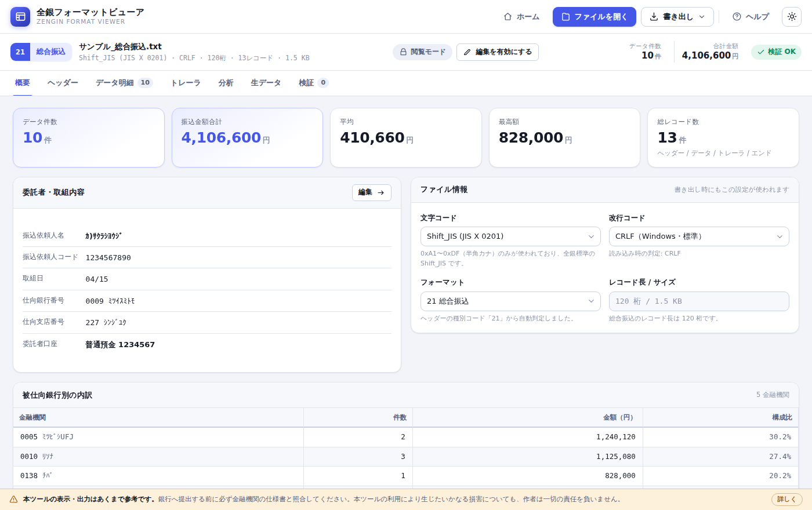

---

## 目次

- [特長](#特長)
- [対応フォーマット](#対応フォーマット)
- [使い方](#使い方)
- [画面の紹介](#画面の紹介)
- [安全性について](#安全性について)
- [扱えないもの](#扱えないもの)
- [動作環境](#動作環境)
- [オフライン（社内ネットワーク）で使う](#オフライン社内ネットワークで使う)
- [開発者向け](#開発者向け)
- [ライセンス](#ライセンス)
- [免責事項](#免責事項)

---

## 特長

| | |
| --- | --- |
| **種別コードを自動判定** | ヘッダーレコードの 2〜3 桁目を読み取り、フォーマットを自動で切り替えます。文字コード（Shift_JIS / UTF-8）、改行コード（CRLF / LF / 改行なし）、レコード長（120 桁 / 200 桁）も自動判定します。 |
| **入金データにも対応** | 銀行からダウンロードした振込入金通知・入出金取引明細・残高通知を、項目名つきの表で確認できます。入金・出金を分けて集計します。 |
| **項目名つきの表で確認** | 「81〜90 桁目」ではなく「振込金額」として読めます。金額はカンマ区切り、預金種目などのコードは意味を併記します。 |
| **その場で編集** | 表計算ソフトのようにセルを編集できます。桁揃え（数字は右詰め 0 埋め、文字は左詰め空白埋め）は自動です。 |
| **全角を自動で半角へ** | `カブシキガイシャ` → `ｶﾌﾞｼｷｶﾞｲｼｬ`、`１２３ＡＢＣ` → `123ABC` のように、全銀で使える文字へ自動変換します。 |
| **提出前の自動チェック** | 桁数・文字種・必須項目・データ区分の並び順・**トレーラの合計件数／合計金額の整合**などを検証し、該当行へジャンプできます。項目ごとの使用可能文字（付録 1）も確認します。 |
| **変更内容を書き出し前に確認** | 読み込み時の内容と突き合わせ、どのレコードのどの項目をどう変えたか、行の追加・削除・並べ替えを一覧で確認できます。 |
| **重複振込の確認** | 同じ口座あてに同じ金額の明細が複数あると警告します（重複が誤りとは限らないため、確認を促す表示です）。 |
| **バイト単位で正確に書き出し** | 未編集なら、読み込んだファイルと 1 バイトも違わないデータを出力します。ダミー領域・未定義バイト・BOM・末尾改行の有無・規定と異なる桁数まで、そのまま保持します。 |
| **CSV 書き出し** | 明細一覧を Excel で開ける CSV として保存できます。 |
| **見やすい画面** | ライト／ダークの両テーマに対応。印刷にも配慮しています。 |

---

## 対応フォーマット

レコードレイアウトは、一般社団法人全国銀行協会
**「AP-Ⅰ-12〔別冊〕全銀協パーソナル・コンピュータ用標準通信プロトコル（ベーシック手順）
適用業務およびレコード・フォーマット」（令和元年 12 月）** に基づいています。

### 銀行へ提出するデータ（1 レコード 120 桁）

| 種別コード | 名称 | 用途 |
| --- | --- | --- |
| `21` | 総合振込 | 取引先への支払を一括で依頼する |
| `11` | 給与振込（民間） | 従業員の給与を一括で振り込む |
| `12` | 賞与振込（民間） | 賞与（ボーナス）を一括で振り込む |
| `91` | 預金口座振替 | 売掛金などを取引先口座から引き落とす（処理結果明細の読み込みにも対応） |

### 銀行から受け取るデータ（1 レコード 200 桁）

| 種別コード | 名称 | 用途 |
| --- | --- | --- |
| `01` | 振込入金通知 | 自社口座への振込入金明細を受け取る |
| `03` | 入出金取引明細 | 口座の入出金取引明細を受け取る |
| `04` | 残高通知（預金） | 口座残高を受け取る |

同じ種別コードでもレイアウトが分かれるフォーマットは、読み込み時に自動で判定します。

- **振込入金通知** … 金額欄が 10 桁のフォーマット A と、12 桁の欄を追加したフォーマット B
- **入出金取引明細** … 普通・当座・貯蓄預金と、通知・定期・積立定期預金でデータ・レコードが異なる

また、**1 つのファイルにヘッダー → データ → トレーラの組を繰り返す構成**（残高通知や入出金取引明細で
口座ごとに繰り返される形）にも対応しています。合計件数・合計金額の検証と再計算は組ごとに行われ、
「データ明細」タブでは口座を選んで絞り込めます。

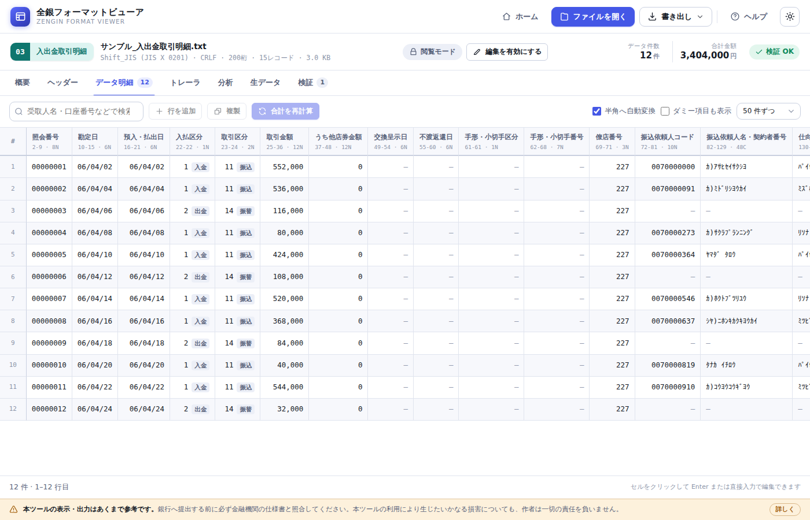

残高通知のように口座ごとにヘッダーが繰り返されるファイルでは、口座を選んで絞り込めます。

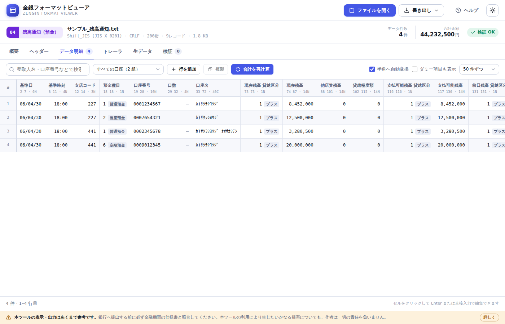

上記以外の種別コードのファイルも読み込めます。その場合は桁の意味を解釈せず、
レコード単位の原文表示になります（保存しても内容は壊れません）。

各フォーマットの詳細な桁位置は **[レコードレイアウト仕様](docs/format-spec.md)** をご覧ください。

---

## 使い方

### 1. ファイルを読み込む

[ツールを開き](https://masakiniwa.github.io/Zengin-Format-Viewer/)、全銀テキストファイルを
**ドラッグ＆ドロップ**するか、「ファイルを開く」から選択します。
手元にファイルが無いときは、初期画面の**サンプルデータ**でお試しいただけます。

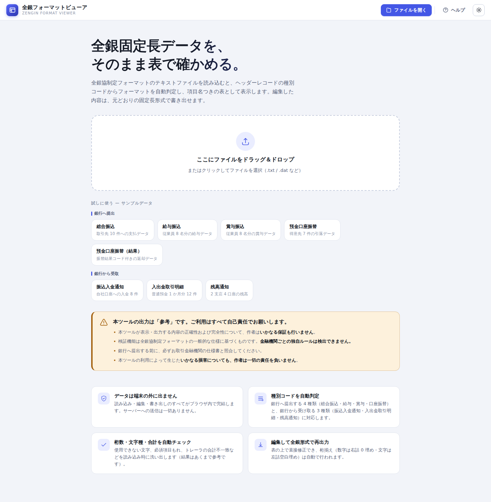

### 2. 内容を確認する

読み込むと、種別・件数・合計金額・委託者情報などが「概要」タブに表示されます。
明細は「データ明細」タブで確認できます。

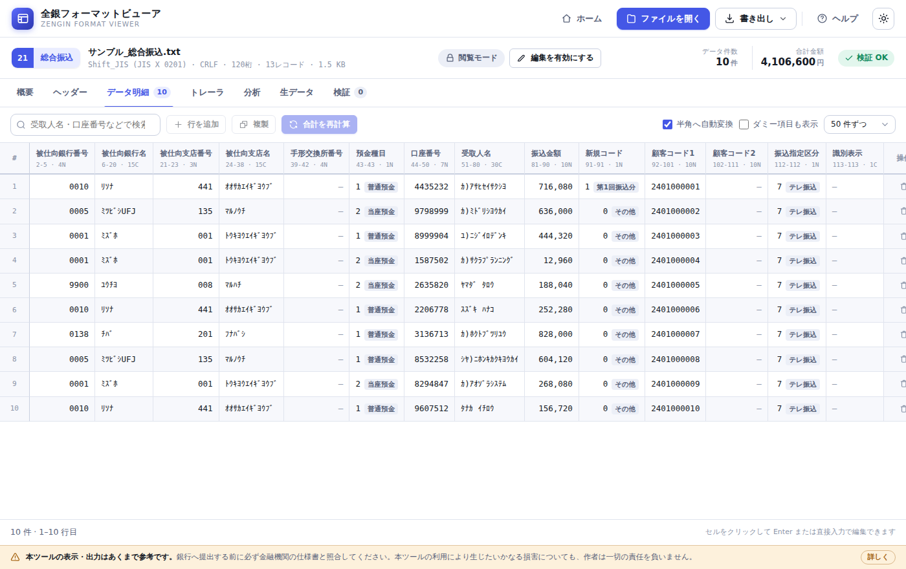

### 3. 編集する — 変更内容はいつでも確認できます

編集を始めると画面上部に「変更 ○ 件（未保存）」と表示され、押すと変更の一覧が開きます。
書き出し前の確認画面からも開けます。この一覧はブラウザのメモリ上だけに保持され、
どこにも送信・保存されません。

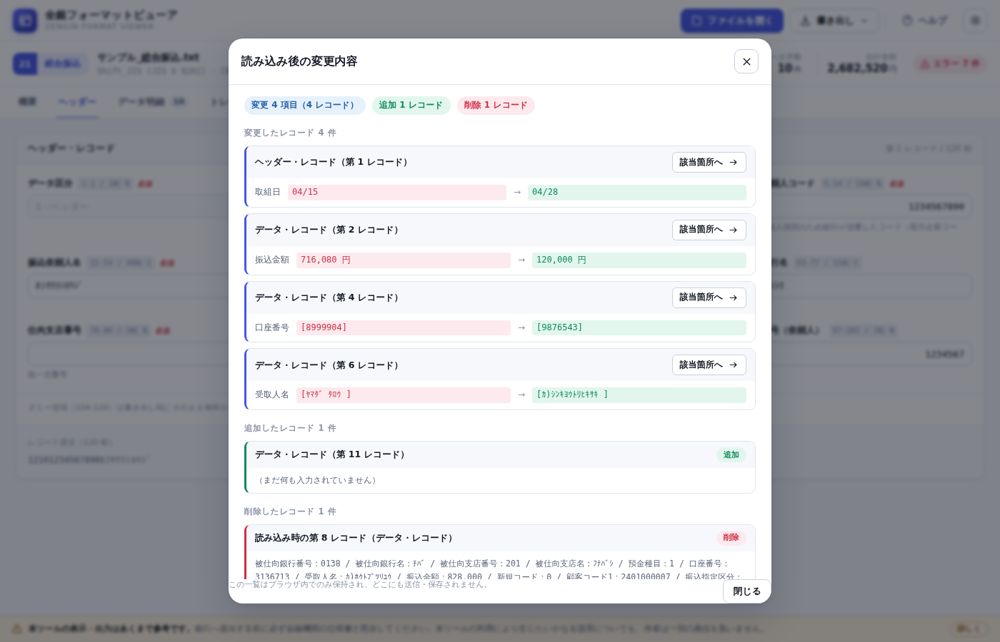


セルをクリックして選択し、そのまま入力するか <kbd>Enter</kbd> で編集を開始します。

| キー | 動作 |
| --- | --- |
| <kbd>↑</kbd> <kbd>↓</kbd> <kbd>←</kbd> <kbd>→</kbd> | セルの移動 |
| <kbd>Enter</kbd> | 編集開始／確定して下のセルへ |
| <kbd>Tab</kbd> | 確定して右のセルへ |
| <kbd>Esc</kbd> | 編集を取り消す |
| <kbd>Delete</kbd> | 選択中のセルを空にする |
| <kbd>Ctrl</kbd> + <kbd>S</kbd> | 全銀固定長で書き出す |
| <kbd>F1</kbd> | ヘルプを開く |

> 💡 **行を追加・削除・金額変更したら「合計を再計算」を押してください。**
> トレーラ・レコードの合計件数・合計金額がデータレコードから自動で計算し直されます。

### 4. 書き出す

画面上部の「書き出し」から、**全銀固定長**または **CSV** で保存します。
文字コードと改行コードは「概要」タブのファイル情報で指定できます。

書き出しの前に確認画面が表示されます。**出力されるファイルはあくまで参考用**です。
銀行へ提出する前に、必ずお取引金融機関の仕様書と照合してください。

### 使い方に迷ったら

画面右上の **「ヘルプ」ボタン**（または <kbd>F1</kbd>）から、ツール内で使い方ガイドを開けます。
レコードレイアウトの一覧もこの中で確認できます。

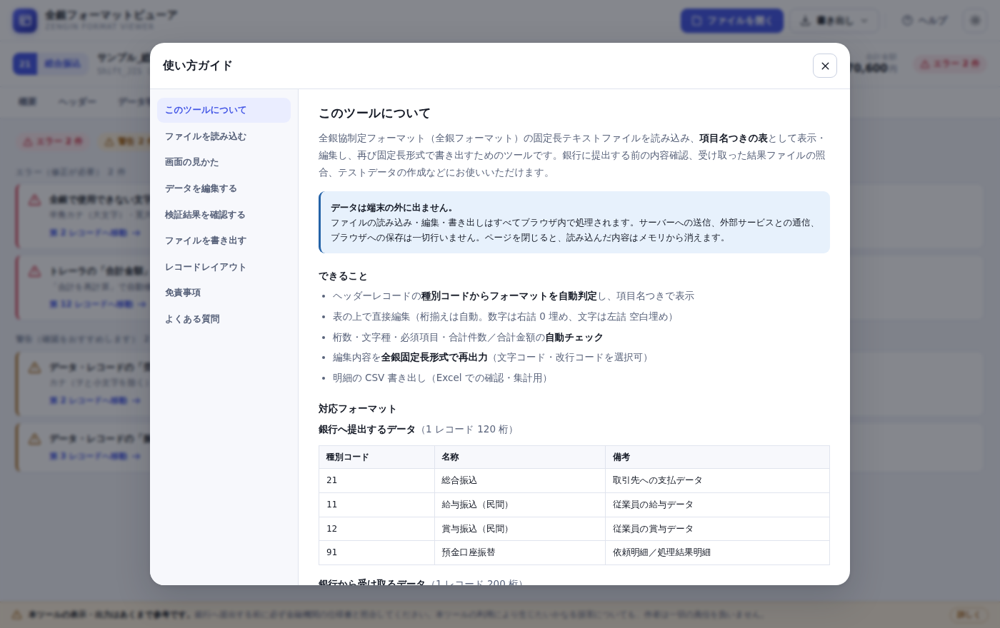

---

## 画面の紹介

### ヘッダー・トレーラ — 項目ごとのフォーム編集

桁位置・桁数・属性を表示しながら、委託者コードや取組日などを安全に編集できます。
固定値の項目（データ区分・種別コード）は誤操作を防ぐため編集できません。

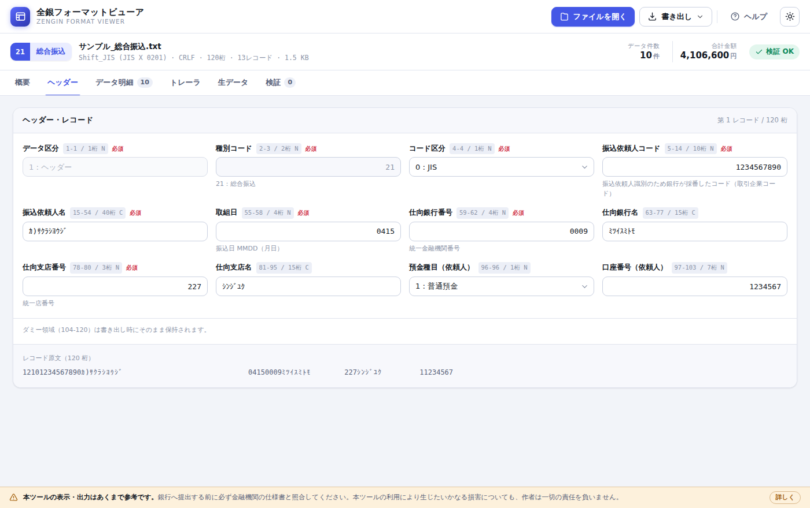

### 生データ — 桁目盛りつきの原文表示

固定長の原文を、桁目盛りと項目ごとの色分けつきで表示します。
**半角カナを含む行でも桁位置がずれない**よう描画しているため、桁ズレの調査に使えます。
行をクリックすると、全項目の内訳が表示されます。

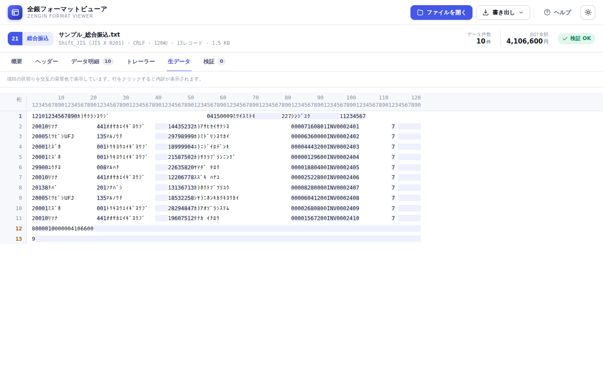

### 検証 — 提出前のチェック

見つかった問題を「エラー（修正が必要）」「警告（確認をおすすめします）」に分けて一覧表示し、
該当のレコードへジャンプできます。「合計を再計算」「レコード長をそろえる」など、
その場で直せる操作も上部に表示されます。

主なチェック内容は次のとおりです。

- レコード長・データ区分の並び（ヘッダー → データ → トレーラの組が複数あっても対応）
- 全銀協の使用文字一覧、および項目ごとの使用可能文字（付録 1 の注記）
- 数字項目に数字と空白が混ざっていないか
- 日付が実在するか（4/31 や 2/30 は指摘。和暦のため 2/29 は許容）
- 規定でスペース／「0」と定められたダミー領域の内容
- トレーラの合計件数・合計金額、エンド・レコードのレコード総件数・口座数
- 預金口座振替の処理結果（振替済・振替不能の件数と金額を結果コードから検算）
- **同一口座・同一金額の重複明細**（振込依頼系のみ）

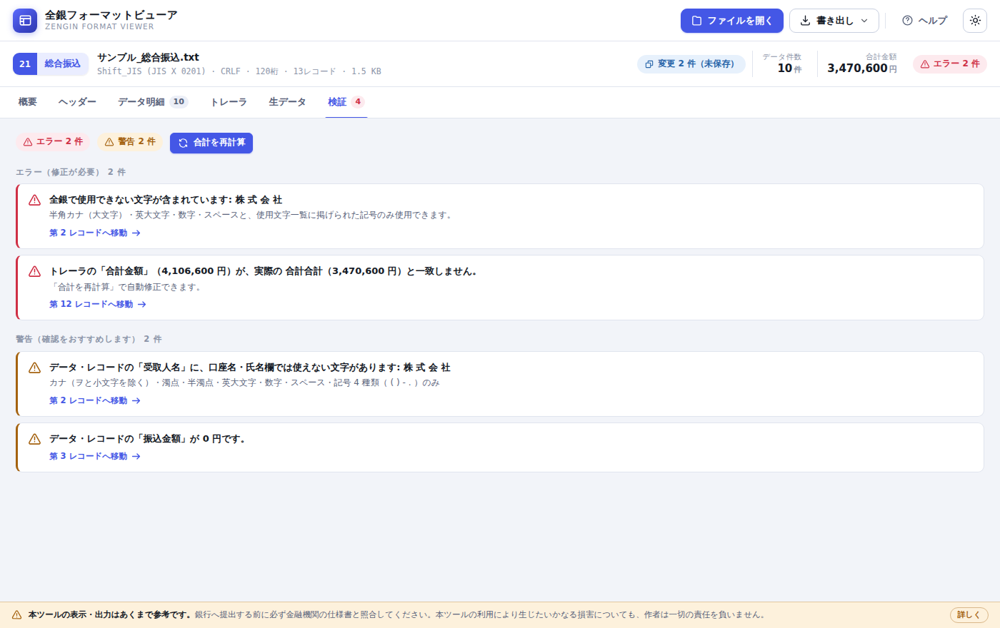

### 預金口座振替の結果 — コード別の内訳

処理結果明細を読み込むと、振替結果コード別の件数・金額・構成比を表示します。

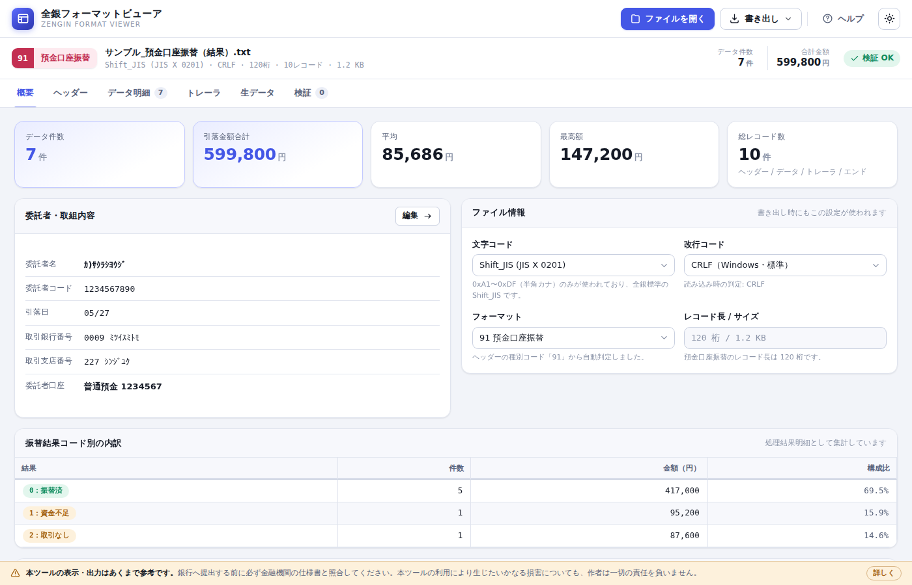

### ダークテーマ

画面右上のボタンでライト／ダークを切り替えられます。設定はブラウザに記憶されます。

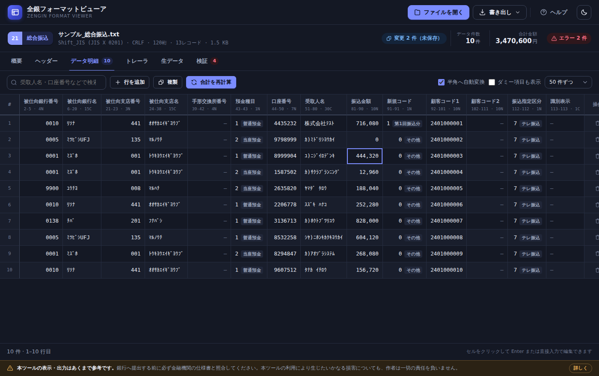

---

## 扱えないもの

- **コード区分が「1：EBCDIC」のファイル**
  本ツールの文字コード処理は JIS（Shift_JIS の 1 バイト領域）と UTF-8 だけです。
  EBCDIC のファイルは画面が文字化けし、書き出しても正しい EBCDIC になりません。
  誤ったファイルを作らないよう、**読み込みは行いますが書き出しを止めます**。
  「生データ」タブで原文を確認するか、JIS のファイルを入手してください。
- 全銀協の規定にある業務のうち、株式配当金振込・財形貯蓄関係・外国為替取引明細などは未対応です。
  読み込みはできますが、桁の意味を解釈せず原文表示になります。

## 安全性について

全銀データには口座番号や氏名などの重要な情報が含まれます。本ツールは次の方針で作られています。

- **通信を一切行いません。** ファイルの読み込みから書き出しまで、すべてブラウザ内（JavaScript）で処理します。
- **外部ライブラリを使いません。** CDN からの読み込みもないため、依存先から情報が漏れる経路がありません。
- **保存しません。** 読み込んだ内容は画面を閉じるとメモリから消えます（記憶するのは画面テーマの設定のみです）。
- **改ざんしません。** 編集していない箇所は、ダミー領域や未定義バイトも含めて 1 バイトも変更せずに書き戻します。

ソースコードはすべてこのリポジトリで公開しています。社内で内容を確認したうえでご利用ください。

---

## 動作環境

- Google Chrome / Microsoft Edge / Firefox / Safari の最新版
- インターネット接続は初回の読み込み時のみ必要です（オフライン利用も可能）

---

## オフライン（社内ネットワーク）で使う

外部サイトへアクセスできない環境でも、ファイル一式をローカルに置くだけで動作します。

1. このリポジトリの **Code → Download ZIP** からファイル一式をダウンロードします
2. 任意のフォルダに展開します
3. `index.html` をブラウザで開きます

外部への通信は行わないため、閉じたネットワークでもそのまま利用できます。
社内の共有フォルダや社内 Web サーバーに配置して、部署で共有することもできます。

---

## 開発者向け

### ディレクトリ構成

```
.
├── index.html              画面の骨格
├── assets/
│   ├── css/app.css         デザインシステム（ライト／ダーク）
│   └── js/
│       ├── charset.js      JIS X 0201 の相互変換・全角→半角正規化
│       ├── formats.js      レコードレイアウト定義（唯一の正）
│       ├── zengin.js       解析・編集・書き出し・検証
│       ├── samples.js      サンプルデータ生成
│       ├── help.js         ツール内ヘルプの本文
│       └── app.js          画面制御
├── docs/
│   ├── format-spec.md      レコードレイアウト仕様（自動生成）
│   └── images/             README 用スクリーンショット
└── tools/
    ├── selftest.mjs        ブラウザ非依存の自己診断
    ├── browser-test.mjs    Playwright による画面の動作確認
    └── gen-format-doc.mjs  レイアウト仕様の生成
```

ビルド不要・依存パッケージなしの素の HTML / CSS / JavaScript です。

### ローカルで動かす

```bash
git clone https://github.com/MasakiNiwa/Zengin-Format-Viewer.git
cd Zengin-Format-Viewer
python3 -m http.server 8000   # 任意の静的サーバーで可
# http://localhost:8000 を開く
```

`index.html` を直接ブラウザで開くだけでも動作します（ES モジュールを使っていないため）。

### テスト

```bash
node tools/selftest.mjs       # ロジックの自己診断（依存パッケージ不要）
node tools/gen-format-doc.mjs # docs/format-spec.md を再生成
```

`selftest.mjs` では次を確認しています。

- 全フォーマットのレコードが規定の桁数（120 桁 / 200 桁）ちょうどであること
- 主要項目の桁位置が全銀協の規定書どおりであること（固定値で照合）
- 0x00〜0xFF がバイト単位で完全に復元されること（無損失な往復）
- サンプルの「生成 → 解析 → 書き出し」がバイト一致すること
- 編集時の桁揃え・桁あふれの切り詰め・合計の再計算
- 新規レコードの初期値（未入力の必須項目は指摘し、未定義コードの警告は出さない）
- 複数グループ（口座ごとのヘッダー繰り返し）の検証と再計算
- データ・レコードのレイアウト自動判定（振込入金通知 A/B、入出金取引明細の預金種目別）。
  1 ファイル内に異なるレイアウトの口座が混在する場合も、口座ごとに判定します
- 項目ごとの使用可能文字（付録 1 の注記）の判定
- 往復の境界条件 9 種（CRLF / LF / 改行なし / BOM / 末尾改行の有無 / 桁数の過不足 / 未定義バイト）
- 数字項目の厳密判定、実在日の判定、ダミー領域の固定値
- EBCDIC 宣言の検出、エンド・レコードの集計値、預金口座振替の処理結果
- 重複明細の判定（同一口座＋同一金額／同一口座＋別金額／別口座＋同一金額）
- 改行なし / LF / UTF-8 / 未対応種別コードのファイルの読み込み

画面の動作確認には Playwright を使ったブラウザテストも用意しています。

```bash
npm i -D playwright && npx playwright install chromium
node tools/browser-test.mjs
```

読み込みからタブ表示・セル編集・全角変換・合計再計算・行操作・書き出し・ヘルプ・
変更内容の差分確認・重複明細の警告・EBCDIC の書き出し停止・ダークテーマ・
狭い画面での表示までを実ブラウザで検証します。
**半角カナを含む行でも生データの桁が揃うこと**もここで確認しています。

### フォーマットを追加する

`assets/js/formats.js` に定義を追加するだけで、画面・検証・ヘルプ・仕様書のすべてに反映されます。

```js
var MY_FORMAT = {
  code: '31', name: '○○振込', shortName: '○振', accent: 'indigo',
  description: '...',
  recordLength: 120,
  records: {
    header: record('1', 'ヘッダーレコード', [
      f('kubun', 'データ区分', 1, 'N', { fixed: '1', role: 'kubun', required: true }),
      f('typeCode', '種別コード', 2, 'N', { fixed: '31', role: 'typeCode', required: true }),
      // ... 合計が 120 桁になるまで項目を並べる（桁位置は自動計算されます）
    ]),
    data: record('2', 'データレコード', [ /* ... */ ]),
    trailer: simpleTrailer(),
    end: endRecord()
  }
};
```

定義したら `FORMATS` へ登録し、`node tools/selftest.mjs` で桁数の整合を確認してください。

主な `role` の意味は次のとおりです。画面の集計や検証はこれを手がかりに動きます。

| role | 用途 |
| --- | --- |
| `kubun` | データ区分 |
| `typeCode` | 種別コード |
| `amount` | データ・レコードの金額（複数の項目に付けると合算されます） |
| `totalCount` / `totalAmount` | トレーラの合計件数・合計金額 |
| `requesterName` / `requesterCode` | 委託者名・会社名などの名義とコード |
| `date` | 取組日・振込指定日・引落日・作成日 |
| `depositType` / `accountNumber` | 口座単位の見出しに使用 |

トレーラの突き合わせ方が単純な合計でない場合（入出金取引明細の入金／出金別集計など）は
`aggregates` に、同じ種別コードでレイアウトが分かれる場合は `variants` と `selectVariant` に
定義を書きます。

### GitHub Pages への公開

`main` ブランチへの push で自動的に公開されます（`.github/workflows/pages.yml`）。
リポジトリの **Settings → Pages → Source** を **GitHub Actions** に設定してください。

---

## ライセンス

[MIT License](LICENSE)

---

## 免責事項

> [!CAUTION]
> **本ツールの表示・出力は、すべて「参考」です。ご利用はすべて利用者ご自身の責任でお願いします。**

- 本ツールが表示・出力する内容の正確性および完全性について、作者は**いかなる保証も行いません**。
- **銀行へ提出する前に、必ずお取引金融機関の仕様書と照合してください。**
  本ツールのレコードレイアウトは全銀協制定フォーマットに基づくものですが、
  金融機関によってダミー領域の用途や任意項目の扱いが異なる場合があります。
- **検証機能は万能ではありません。** 使用できる記号、顧客コードの使い方、依頼可能な金額の上限など、
  金融機関ごとの独自ルールは検出できません。検証で「問題なし」と表示されても、
  そのまま受け付けられることを保証するものではありません。
- **重複振込の警告は、あくまで確認のきっかけです。** 重複が誤りとは限らず、
  また警告が出ないことが重複していないことの証明にもなりません。
- **本ツールの利用によって生じたいかなる損害についても、作者は一切の責任を負いません。**
- 本ツールは MIT ライセンスで公開されています。ソフトウェアは「現状のまま」提供され、
  明示・黙示を問わずいかなる保証もありません。

免責事項は、ツール内の以下の場所にも表示されます。

| 場所 | 内容 |
| --- | --- |
| 初期画面 | 読み込み前に表示される注意書き |
| 作業画面の下部 | 常時表示される免責バー（「詳しく」からヘルプへ） |
| 書き出し時 | 参考ファイルである旨の確認画面（キャンセル可能） |
| ヘルプ | 「免責事項」の節 |

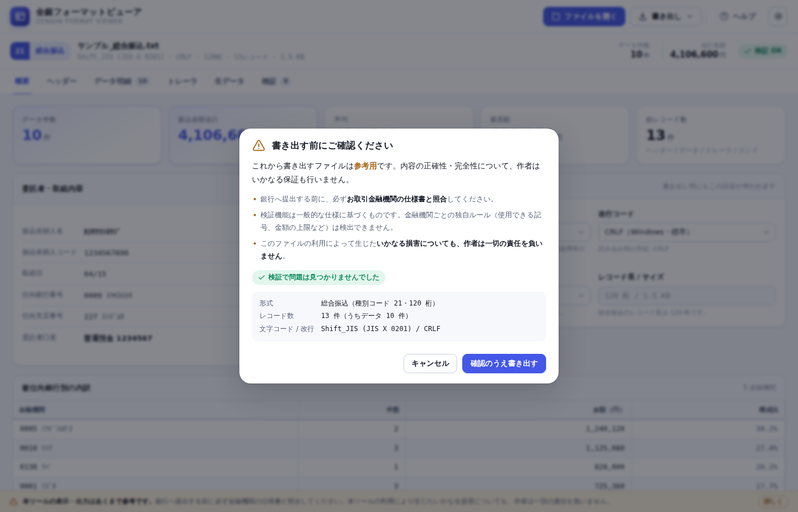

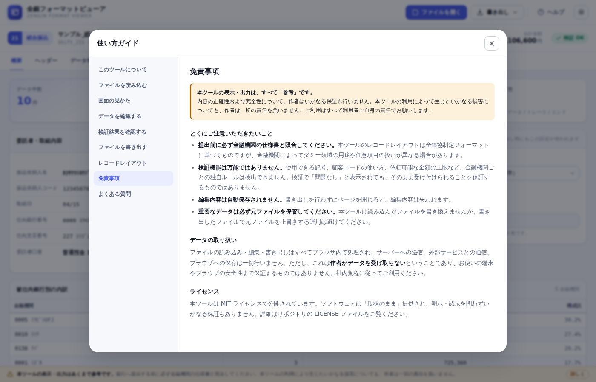
